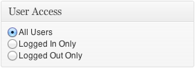
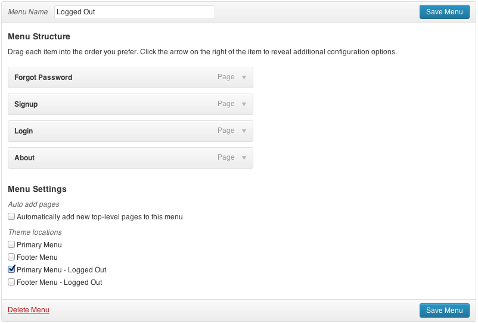
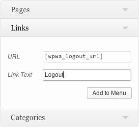
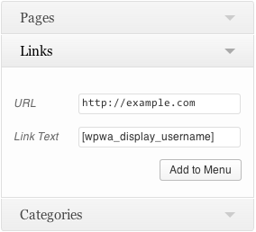
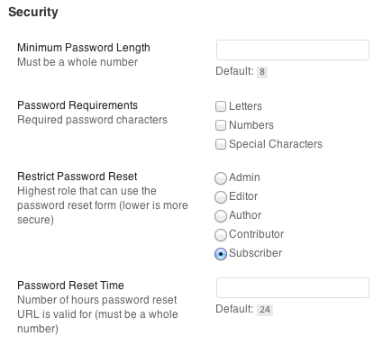
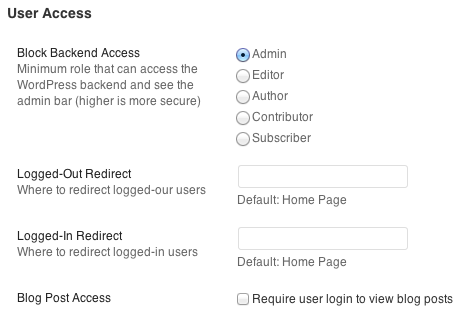

# WordPress for Web Apps

A plugin that provides the essential components you need to power your web app with WordPress.

* Front-end login, sign-up, password reset, and password change forms.
* A delete account button for the front-end.
* Separate navigation menus for logged-in and logged-out users.
* User access settings, so you can selectively hide content from logged-out (or logged-in) users.
* Security settings let you set password requirements, hide the admin bar, and block backend access.
* The web app settings panel lets you easily configure error messages, button text, and more.

[Download Web App Starter Kit 3](https://github.com/cferdinandi/web-app-starter-kit/archive/master.zip)

**In This Documentation**

1. [Getting Started](#getting-started)
2. [User Experience](#user-experience)
3. [Adding Forms](#adding-forms)
4. [User Profiles](#user-profiles)
5. [User Access](#user-access)
6. [Navigation](#navigation)
7. [Settings](#settings)
8. [How to Contribute](#how-to-contribute)
9. [License](#license)
10. [Changelog](#changelog)


## Getting Started

Getting started with WordPress for Web Apps is as simple as installing a plugin:

1. Upload the `web-app-starter-kit` folder to the `/wp-content/plugins/` directory.
2. Activate the plugin through the Plugins menu in WordPress.

And that's it, you're done. Nice work! Keep reading to learn how to take advantage of the built-in features.


## User Experience

WordPress for Web Apps takes a different approach to the signup, login and password reset processes than the default WordPress settings.

These changes provide a better user experience and are more inline with external best-practices.

### Login

WordPress for Web Apps lets users login with either their username or their email address. Don't remember your username? No problem!

### Signup

Unlike the WordPress default, users get to create their own password at signup. After choosing a username and password, and providing an email address, they're logged straight in. No waiting for a confirmation email, and no more passwords emailed in plain text (which is really bad for security).

### Password Resets

Users who forget their password can provide their username or email address to have a reset URL sent to them. Reset URLs are only good for 24 hours by default and are unique to the user (better for security). After clicking the link, users get to pick their own new password and get logged right in.


## Adding Forms

There are two ways to add forms to your app:

1. With a shortcode in the WordPress content editor.
2. With a function in one of your theme template files.

### Login Form

```php
[wpwa_login_form]
<?php echo wpwebapp_form_login(); ?>
```

### Sign-Up Form

```php
[wpwa_signup_form]
<?php echo wpwebapp_form_signup(); ?>
```

### Change Password Form

```php
[wpwa_pw_change_form]
<?php echo wpwebapp_form_pw_change(); ?>
```

### Forgot Password Form

```php
[wpwa_forgot_pw_form]
<?php echo wpwebapp_form_pw_forgot_and_reset(); ?>
```

### Delete Account

```php
[wpwa_delete_account_form]
<?php echo wpwebapp_form_delete_account(); ?>
```

*Note:* The Delete Account button doesn’t include any sort of confirmation message or verification, so you should add your own. You might have an initial “Delete Account” button that opens a [modal window](http://cferdinandi.github.io/modals/), a [drop-down menu](http://cferdinandi.github.io/houdini/), or a new page where the real delete button resides.


## User Profiles

User's can create and manage profiles from the WordPress front-end. (*This functionality is currently in development.*)

### Display Gravatar

```php
[wpwa_display_gravatar]
<?php echo wpwebapp_display_gravatar(); ?>
```

### Coming Soon

* Name
* Description/Bio
* Links


## User Access

You may have content that you only want users to view if they're logged in. You might also have content that you only want people to have access to if they're logged out (like a password reset form or the login screen).



Simply select the appropriate user access setting from the options menu in the sidebar when you create a page. WordPress for Web Apps handles the rest, redirecting users to a landing page if they don't have permission to view the content.


## Navigation

You may want to show different navigation elements to users who are logged in versus those who are not.

WordPress for Web Apps creates `* - Logged Out` versions of any navigation menus that are registered in your theme. Just use the drag-and-drop menu tool in the admin dashboard, and assign your navigation to the appropriate menu.



Menus without the `- Logged Out` suffix are only shown to logged-in users. If you don't assign logged-out menus, they show all pages by default.

### Logout Links

WordPress provides a built-in logout link function:

```html
<a href="<?php echo wp_logout_url(); ?>">Sign Out</a>
```

Simply add that as the `href` value to any link to log a user out and redirect them to the homepage.

You can't use PHP scripts in the WordPress content editor, though. If you'd like to add a logout link that way, WordPress for Web Apps includes a shortcode you can use instead: `[wpwa_logout_url]`.

```html
<a href="[wpwa_logout_url]">Sign Out</a>
```

While you normally can't use shortcodes to add navigation menu links, WordPress for Web Apps let you use the logout shortcode.



### Usernames

WordPress also provides a simple way to display a user's username in a theme template file:

```php
<?php $current_user = wp_get_current_user(); echo $current_user->user_login; ?>
```

To display a username in the WordPress content editor, use the `[wpwa_display_username]` shortcode. Like the logout shortcode, you can use the display username shortcode in the navigation menu editor.




## Settings

Don't want to mess around with settings? That's ok. WordPress for Web Apps includes a bunch of smart defaults so you don't have to.

But if you want more control, you've got it. The "Web App Options" page in the admin dashboard makes it easy to customize and control password requirements, button text and styling, alert messages and more.

### Security

Change the minimum password length, add character requirements, limit who can use the "forgot password" form, and change the number of hours a password reset email is valid.



### User Access

Control who can access the backend (and see the admin bar), decide what page to redirect logged-in and logged-out users to, and restrict access to blog posts.



### Forms

Assign a button class, change the text of buttons and labels, and pick a link for the forgot password page (this is the only setting that won't work if you don't give it a value).

### Alerts

Whether form fields are left blank or passwords don't match, there's an error message for most form issues. Change the defaults to suit your apps personality and style.

### User Profiles

Assign a default gravatar size for user profiles.

### Emails

WordPress sends out a few default emails that aren't neccessarily a great user experience for you or your users. WordPress for Web Apps disables them by default, but you can reactivate them if you want to.


## How to Contribute

In lieu of a formal style guide, take care to maintain the existing coding style. Don't forget to update the version number, the changelog (in the `readme.md` file), and when applicable, the documentation.


## License

WordPress for Web Apps is licensed under the [MIT License](http://gomakethings.com/mit/).


## Changelog

* v3.6 - April 5, 2014
	* Added gravatar shortcode.
* v3.5 - April 5, 2014
	* Split forms and options across multiple files for more modular code structure.
* v3.4 - November 10, 2013
	* [Added a delete account button for the front-end](https://github.com/cferdinandi/web-app-starter-kit/issues/7)
* v3.3 - October 31, 2013
	* [Added a link to settings from plugin menu](https://github.com/cferdinandi/web-app-starter-kit/issues/13)
* v3.2 - October 18, 2013
	* Fixed [incorrect i18n](https://github.com/cferdinandi/web-app-starter-kit/issues/12).
	* Change `home_url()` to `site_url()`. [Fixed issue 5](https://github.com/cferdinandi/web-app-starter-kit/issues/5)
* v3.1 - October 4, 2013
	* Updated `wpwebapp_disable_admin_bar()` to allow user preferences for users who have access.
* v3.0 - September 28, 2013
	* Converted from a collection of theme functions to a plugin.
	* Completely rebuilt forms for better consistency, security, and UX.
	* Changed signup process: user creates their own password and can login immediately.
	* Changed password reset process: user selects their new password (not WordPress).
	* Added password requirement check to signup and password change and reset processes.
	* Integration with `wp_nav_menu()` for separate logged-in and logged-out navigation with any theme.
	* Added Web App Settings page for easier adjustment of alerts, security settings, form styling, and more.
* v2.1 - June 7, 2013
	* Switched to MIT license.
* v2.1 - June 6, 2013
	* Split functions into individual files for easier inclusion and exclusion.
* v2.0 - May 17, 2013
	* Completely rebuilt.
* v1.0 - January 23, 2013
	* Initial GitHub Release (previously self-hosted).